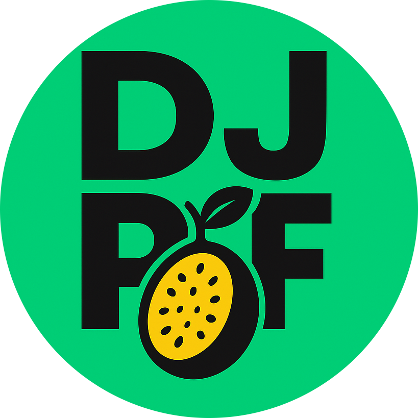
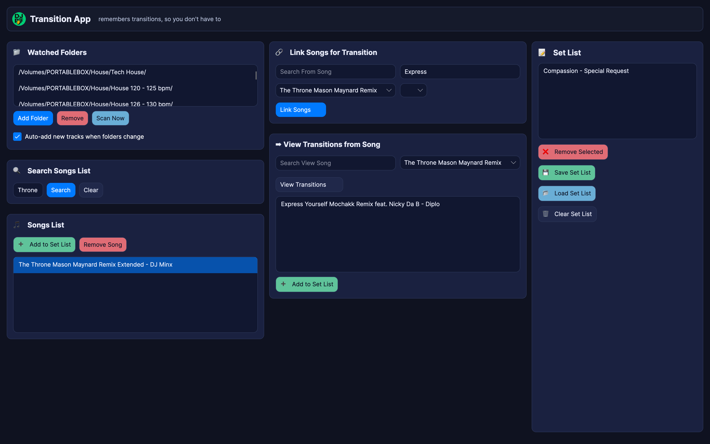
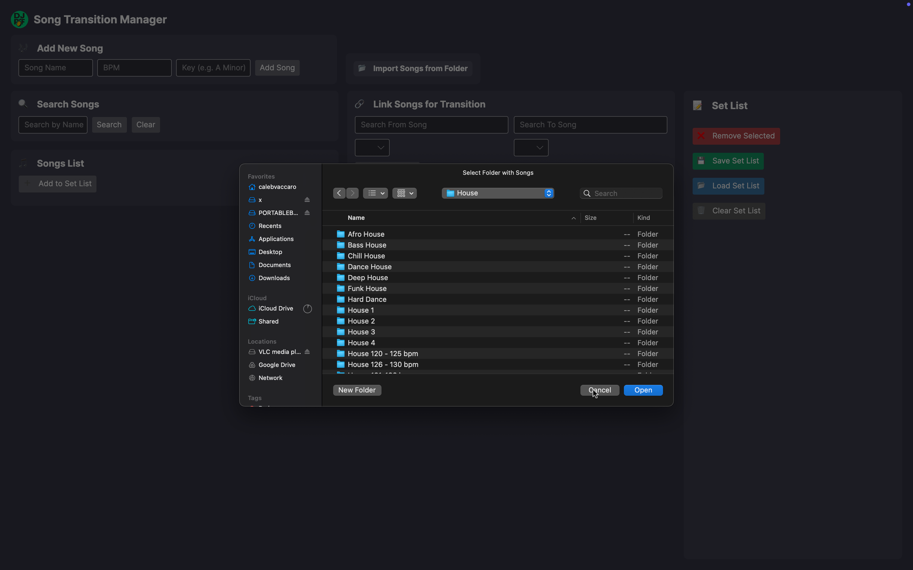
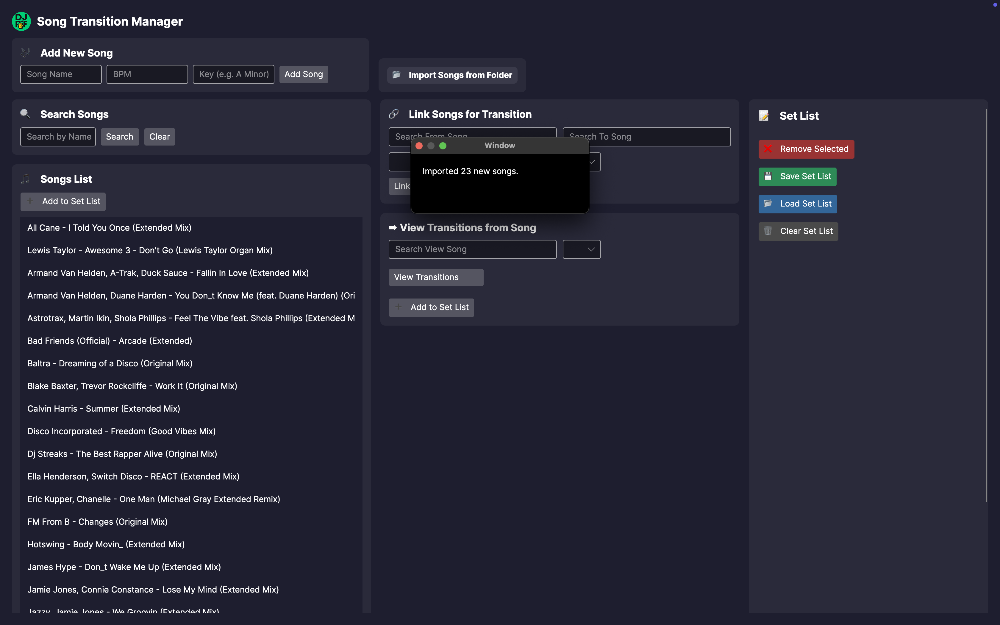
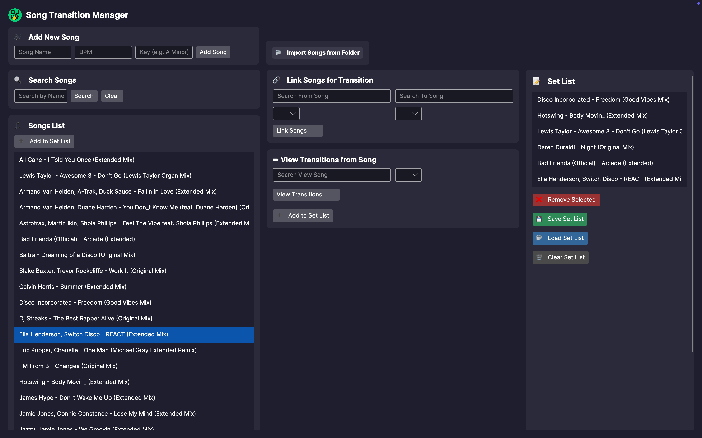

#  TransitionsApp

**TransitionsApp** is a desktop app for DJs who want a better way to save and organize their favorite song transitions and create killer set lists.

Forget trying to remember what songs worked well together or digging through Rekordbox history — this is your personal vault of bangers and blends.

---

## 📸 Screenshots

### 🖥️ App Layout  
The main dashboard where you can manage your song bank and set lists.  

---

### 📁 Load Your Music  
Easily import a folder full of `.wav` or `.mp3` files.  

---

### 🎶 Song Bank  
All your tracks in one place, ready to be tagged and sorted.  

---

### 🎛️ Create a Set List  
Drag and drop your favorite tracks to plan the perfect set.  

---

## 🧠 Why I Built This

I'm a DJ who's been chasing that perfect flow between tracks since I started spinning. But Rekordbox and other DJ software just don't offer a clean way to **save and recall your favorite transitions**.

**TransitionsApp** is my way of capturing the magic — the energy — of those moments when two tracks just *work*. Now, I can build out my best transitions, track combinations, and future sets in one simple tool.

---

## ⚡️ Coming Soon

- Tagging by mood or energy  
- Rekordbox Integration (BPM and key detection, etc.)

---

Thanks for checking it out.  
Drop a star ⭐ if you’re vibing with it!

🪩  
`- Caleb (DJ PF)`